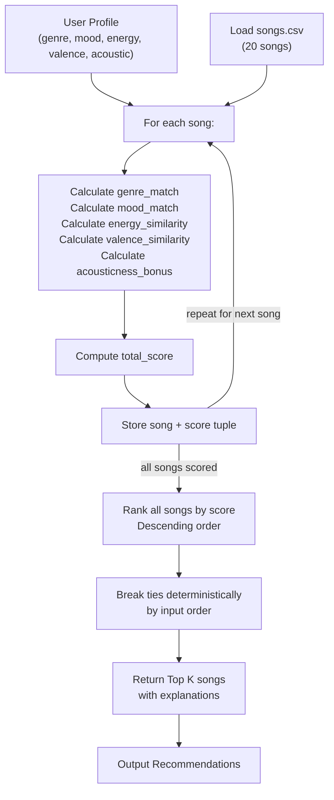

# Music Recommender Data Flow

## Process Steps

1. **Input**: User profile dict + songs CSV loaded
2. **Scoring Loop**: For each of 20 songs:
   - Compare genre/mood (binary match: 0 or 1)
   - Calculate energy_similarity (1.0 - abs difference)
   - Calculate valence_similarity (1.0 - abs difference)
   - Add acousticness_bonus if user prefers acoustic AND song is acoustic
   - Store (song, total_score)
3. **Ranking**: Sort all scored songs by total_score descending
4. **Tie-Breaking**: Maintain input order for same scores (deterministic)
5. **Output**: Return top K songs with explanations showing matched features
